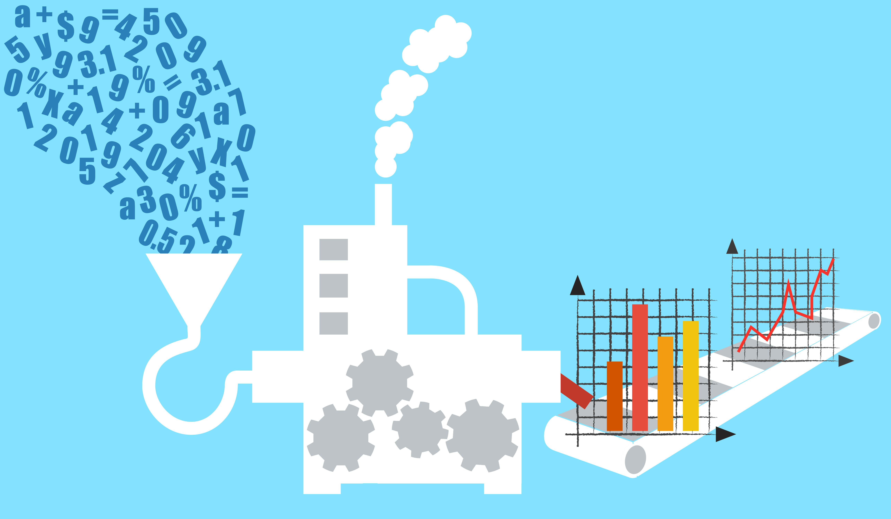

# Welcome to __Apache Spark__

---


# whoami

- Ruben Berenguel (@berenguel)
- PhD in Mathematics
- (big) data consultant
- Senior crafter in **Python**, **Go** and **Scala**
- Right now at **Affectv**

---

# whoami

- Carlos Peña (@crafty_coder)
- Senior Software Engineer
- (big) data consultant
- Crafting code using **Scala**, **Java** and **Python**
- Learning **ML** & **Deep Learning**

---
[.build-lists: true]

# What is __Spark__?

- Distributed Computation __framework__
- Open source
- __SQL__ Friendly
- Focus on __Data Processing__

^ This is a presenter note!

---

# Data processing?


---

## Transform Data


---

## Extract information


---

# Why __Spark__?

---


## Scales
## __horizontally__
## and
## __vertically__

---


## Lets you write complex operations __easily__ and __safely__

---

## Interactive
---


# Supports __Scala__, __Java__, __Python__ & __R__

---

# How does __Spark__ work?

---


# Spark usually sits on top of a __cluster manager__


^ This can be standalone, YARN, Mesos or in the bleeding edge, Kubernetes (using the Kubernetes scheduler)

---


# And a __distributed storage__

---


## A Spark program runs in the __driver__

---


## The __driver__ requests resources to the __cluster manager__ to run tasks

^ We usually don't need to worry about what the executors do (unless they blow up)
 Image about executors only and executors inside machines

---

### Two kind of operations:

## __Transformations__
## &
## __Actions__

---

__Transformations__: Reshape the data. They are part of __stages__

* Filter
* Map
* Join

---


__Actions__: Return a result. They define __jobs__

* Count
* Show
* Write

---


---

# Example Time!

---


## We will use a [Kaggle dataset](https://www.kaggle.com/dansbecker/nba-shot-logs/data) with __basketball shots from the 2016 NBA season__

---


---

# Information we want to extract

* best scorers
* and their shooting range

---

# __Select__

| #   | Dist   | Pts | Player          |
|-----|--------|-----|-----------------|
| _0_ | _6.9_  | _0_ | _carlos boozer_ |
| _1_ | _6.2_  | _2_ | _stephen curry_ |
| _2_ | _4.5_  | _0_ | _anthony davis_ |
| _3_ | _19.1_ | _3_ | _dirk nowitzki_ |
| _4_ | _20.3_ | _2_ | _kobe bryant_   |

---

# __Filter (1)__

| \#      | Dist       | Pts     | Player              |
|---------|------------|---------|---------------------|
| _0_     | _6.9_      | _0_     | _carlos boozer_     |
| __*1*__ | __*6.2*__  | __*2*__ | __*stephen curry*__ |
| _2_     | _4.5_      | _0_     | _anthony davis_     |
| __*3*__ | __*19.1*__ | __*3*__ | __*dirk nowitzki*__ |
| __*4*__ | __*20.3*__ | __*2*__ | __*kobe bryant*__   |


---

# __Filter (2)__

| Dist   | Pts | Player          |
|--------|-----|-----------------|
| `6.2`  | `2` | _stephen curry_ |
| `19.1` | `3` | _dirk nowitzki_ |
| `20.3` | `2` | _kobe bryant_   |

---

# __Group by Player__

| Dist (group)     | Pts (group)   | Player          |
|------------------|---------------|-----------------|
| `[6.2, 3.1,...]` | `[2, 2, ...]` | _stephen curry_ |
| `[19.1, 35,...]` | `[3, 2, ...]` | _dirk nowitzki_ |
| `[20.3, 0,...]`  | `[2 2, ...]`  | _kobe bryant_   |

---

# __Aggregate & sort__

| Avg(Dist) | Sum(Pts)  :arrow_down_small: | Count(1) | Player          |
|-----------|------------------------------|----------|-----------------|
| `12.1`    | `999`                        | `450`    | _stephen curry_ |
| `42.0`    | `998`                        | `442`    | _dirk nowitzki_ |
| `12.5`    | `997`                        | `300`    | _kobe bryant_   |


---

```scala
spark.read
  .option("header", true)
  .csv("shot_logs.csv")
  .filter('PTS !== 0)
  .select(
      'player_name,
      'SHOT_DIST,
      'PTS)
  .groupBy('player_name)
  .agg(
       avg('SHOT_DIST),
       count(1),
       sum('PTS))
  .sort(desc("sum(PTS)"))
  .show
```

---


```scala, [.highlight:]
spark.read
  .option("header", true)
  .csv("shot_logs.csv")
  .filter('PTS !== 0)
  .select(
      'player_name,
      'SHOT_DIST,
      'PTS)
  .groupBy('player_name)
  .agg(
       avg('SHOT_DIST),
       count(1),
       sum('PTS))
  .sort(desc("sum(PTS)"))
  .show
```

---


```scala, [.highlight: 1,2,3]
spark.read
  .option("header", true)
  .csv("shot_logs.csv")
  .filter('PTS !== 0)
  .select(
      'player_name,
      'SHOT_DIST,
      'PTS)
  .groupBy('player_name)
  .agg(
       avg('SHOT_DIST),
       count(1),
       sum('PTS))
  .sort(desc("sum(PTS)"))
  .show
```
---


```scala, [.highlight: 1,2,3]
spark.read
  .option("header", true)
  .csv("shot_logs.csv")
  .filter('PTS !== 0)
  .select(
      'player_name,
      'SHOT_DIST,
      'PTS)
  .groupBy('player_name)
  .agg(
       avg('SHOT_DIST),
       count(1),
       sum('PTS))
  .sort(desc("sum(PTS)"))
  .show
```

---


```scala, [.highlight: 4,5,6,7,8]
spark.read
  .option("header", true)
  .csv("shot_logs.csv")
  .filter('PTS !== 0)
  .select(
      'player_name,
      'SHOT_DIST,
      'PTS)
  .groupBy('player_name)
  .agg(
       avg('SHOT_DIST),
       count(1),
       sum('PTS))
  .sort(desc("sum(PTS)"))
  .show
```

---


```scala, [.highlight: 4,5,6,7,8]
spark.read
  .option("header", true)
  .csv("shot_logs.csv")
  .filter('PTS !== 0)
  .select(
      'player_name,
      'SHOT_DIST,
      'PTS)
  .groupBy('player_name)
  .agg(
       avg('SHOT_DIST),
       count(1),
       sum('PTS))
  .sort(desc("sum(PTS)"))
  .show
```

---


```scala, [.highlight: 9,10,11,12,13]
spark.read
  .option("header", true)
  .csv("shot_logs.csv")
  .filter('PTS !== 0)
  .select(
      'player_name,
      'SHOT_DIST,
      'PTS)
  .groupBy('player_name)
  .agg(
       avg('SHOT_DIST),
       count(1),
       sum('PTS))
  .sort(desc("sum(PTS)"))
  .show
```

---


```scala, [.highlight: 9,10,11,12,13]
spark.read
  .option("header", true)
  .csv("shot_logs.csv")
  .filter('PTS !== 0)
  .select(
      'player_name,
      'SHOT_DIST,
      'PTS)
  .groupBy('player_name)
  .agg(
       avg('SHOT_DIST),
       count(1),
       sum('PTS))
  .sort(desc("sum(PTS)"))
  .show
```

---


```scala, [.highlight: 14,15]
spark.read
  .option("header", true)
  .csv("shot_logs.csv")
  .filter('PTS !== 0)
  .select(
      'player_name,
      'SHOT_DIST,
      'PTS)
  .groupBy('player_name)
  .agg(
       avg('SHOT_DIST),
       count(1),
       sum('PTS))
  .sort(desc("sum(PTS)"))
  .show
```
---


---


---

# There is no silver bullet

---

# __Resources__

* [Spark documentation](https://spark.apache.org/docs/latest/)
*  [High Performance Spark by Holden Karau](https://www.amazon.com/High-Performance-Spark-Practices-Optimizing/dp/1491943203/ref=sr_1_3?ie=UTF8&qid=1528135254&sr=8-3&keywords=holden+karau)
* [Mastering Apache Spark 2.3 by Jacek Laskowski](https://jaceklaskowski.gitbooks.io/mastering-apache-spark/)
* [Spark's Github](https://github.com/apache/spark)
* [Become a contributor](https://spark.apache.org/contributing.html)

---

# Questions?

---


# __Thanks!__
